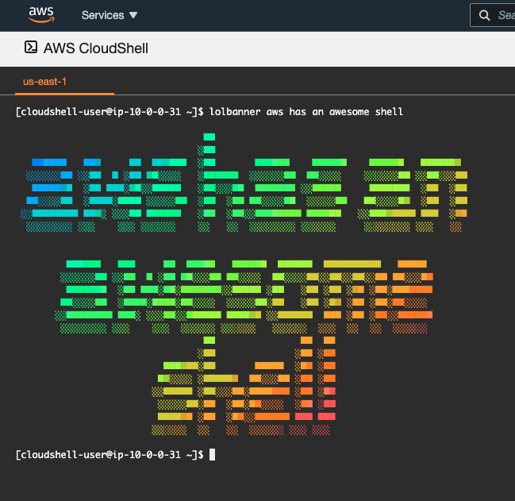

# cloudshell_lolbanner
## AWS Cloudshell with rainbow banner (lolcat / figlet)

### Make a colorful banner on your AWS Cloudshell

Copy script <a href="https://gist.github.com/abduljaleel/387c92585e80865f4510a473d0f4acf4"> this Gist </a> 
This installs ruby, lolcat, figlet and configure lolbanner
Run the script

Type lolbanner aws has an awesome shell

